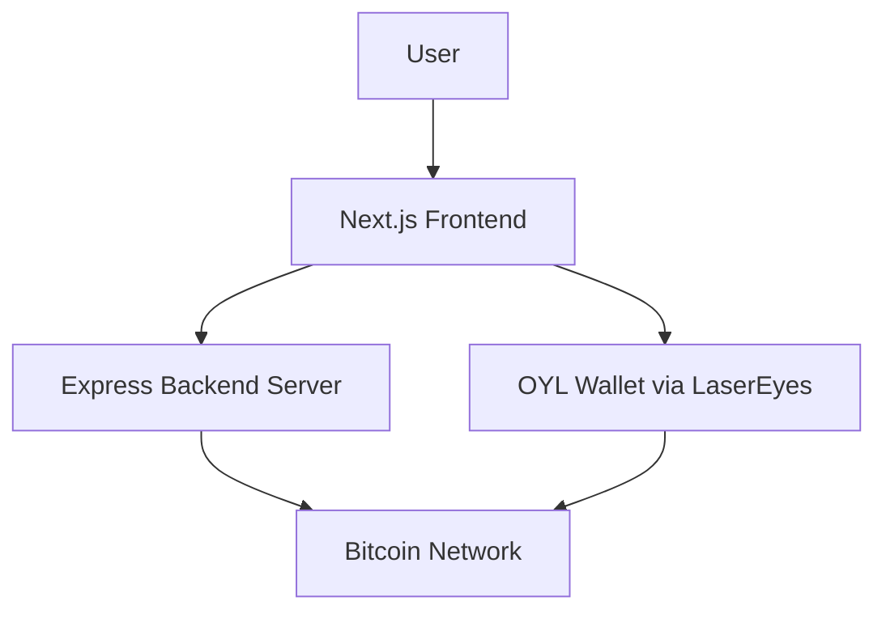
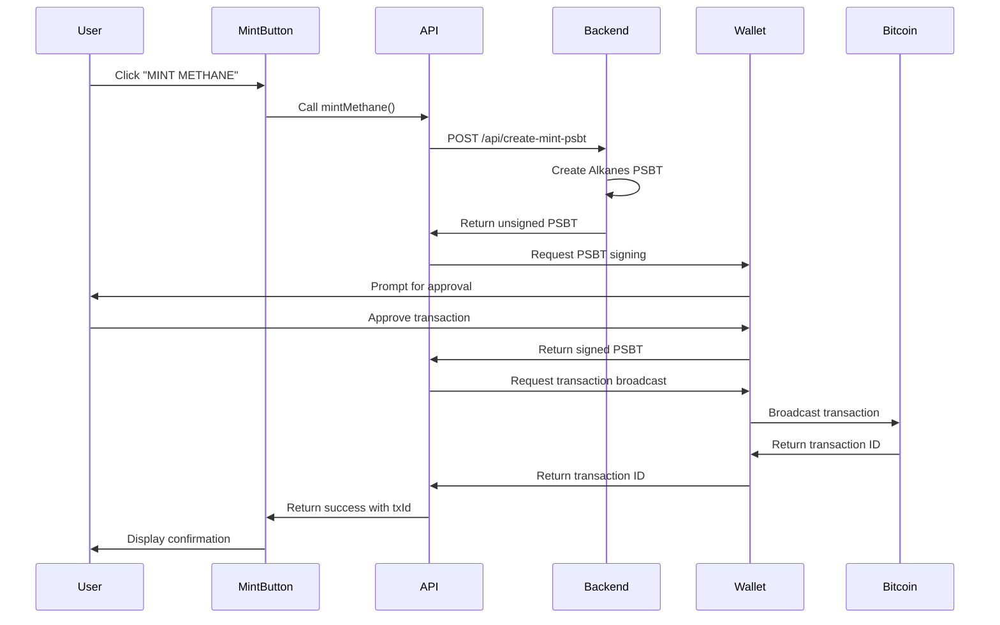

# System Patterns: Methane

## Architecture Overview

The Methane application follows a client-server architecture with the following components:



## Key Components

### 1. Frontend Application

- **Next.js Application**: Built with Next.js, React, and TypeScript
- **LaserEyes SDK Integration**: Uses the LaserEyes provider for wallet connection
- **Component-Based Architecture**: Structured with focused, reusable components
- **Tailwind CSS**: For styling and responsive design

### 2. Backend Server

- **Express.js Server**: Handles API requests for PSBT creation
- **OYL SDK Integration**: Creates properly formatted PSBTs for the Alkanes protocol
- **Enhanced Logging**: Uses morgan for request logging
- **Environment Configuration**: Uses dotenv for environment variables
- **Mock Implementation**: Currently uses a simplified mock implementation

### 3. Wallet Integration

- **OYL Wallet**: External wallet that handles key management and transaction signing
- **LaserEyes Provider**: Structured approach to wallet connection and state management
- **TypeScript Interfaces**: Well-defined interfaces for wallet interaction

## Data Flow

### Minting Flow



## Design Patterns

### 1. Provider Pattern

The LaserEyes SDK uses the Provider pattern to make wallet functionality available throughout the application:

```typescript
// LaserEyesWrapper.tsx
export default function LaserEyesWrapper({
  children,
}: {
  children: React.ReactNode;
}) {
  return (
    <LaserEyesProvider config={{ network: 'mainnet' }}>
      {children}
    </LaserEyesProvider>
  );
}
```

### 2. React Hooks

The application uses React hooks for state management and side effects:

- `useState`: For managing component state
- `useEffect`: For handling side effects like wallet connection
- `useLaserEyes`: Custom hook from the LaserEyes SDK for wallet functionality

### 3. Component Composition

The application uses component composition to build the UI:

- `Layout`: Provides the overall structure and LaserEyes provider
- `Home`: Main page component with the application content
- `MintButton`: Focused component for handling minting functionality

## Technical Decisions

### 1. Next.js Framework

The application uses Next.js as the frontend framework, providing benefits such as:
- Server-side rendering capabilities
- Optimized build process
- File-based routing
- TypeScript integration

### 2. TypeScript

The application uses TypeScript for type safety and better developer experience:
- Type definitions for the OYL wallet interface
- Strongly typed component props
- Better IDE support and code completion

### 3. Mock Backend Implementation

The backend still uses a mock implementation instead of the actual OYL SDK integration. This allows for development and testing without the full SDK but needs to be replaced for production.

### 4. Tailwind CSS

The application uses Tailwind CSS for styling, providing:
- Utility-first approach
- Responsive design capabilities
- Consistent design system
- Reduced CSS bundle size

## Areas for Improvement

1. **UI Components**: Replace alert dialogs with proper UI components for notifications
2. **Error Handling**: Implement a more comprehensive error handling strategy
3. **Real SDK Integration**: Replace mock implementation with actual OYL SDK integration
4. **Testing**: Add unit and integration tests for the application
5. **Performance Optimization**: Implement code splitting and optimize bundle size
